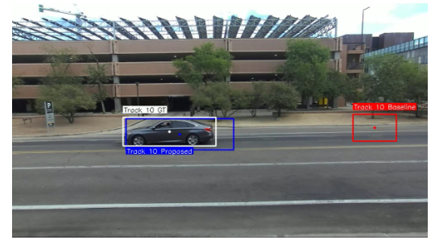
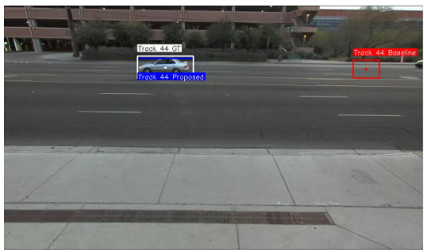

# Vision-based Communication with Object Tracking

> **Note:** This project was developed at the **Sejong University VLI Lab**. Source code is not publicly available due to confidentiality restrictions.

## Highlights

- **+20–29% average data rate improvement** over conventional delayed-detection beamforming across all scenarios
- **Vision-guided predictive beamforming** — YOLO11 detects vehicles, ByteTrack maintains identity, linear prediction forecasts position to overcome latency
- **Validated on real-world data** — DeepSense 6G dataset with synchronized camera, GPS, LiDAR, and wireless signals
- **End-to-end pipeline** — from raw camera frames to antenna gain and spectral efficiency (bps/Hz)

---

## Demo





---

## Results

*DeepSense 6G dataset · 960×540 resolution · 30 fps tracking · SNR range 0–30 dB*

| Scenario | Baseline Rate | **Proposed Rate** | Improvement |
|---|---|---|---|
| A (Scenario 13) | 2.786 bps/Hz | **3.592 bps/Hz** | **+28.93%** |
| B (Scenario 9) | 2.999 bps/Hz | **3.605 bps/Hz** | **+20.19%** |
| C (Scenario 3) | 2.759 bps/Hz | **3.529 bps/Hz** | **+27.93%** |

The predictive method consistently outperformed the baseline across all three real-world driving scenarios. The largest gain — **nearly 29%** — was achieved in Scenario A (highway driving).

**Why it works:** Beamforming requires precise antenna alignment with the target vehicle. The baseline system steers the beam toward the *last known position*, so it always lags behind a moving vehicle. The proposed system forecasts *where the vehicle will be* when the beam forms and steers there instead — cutting pointing error and preserving antenna gain.

---

## Problem

**Challenge:** Moving vehicles in vehicular communication introduce a delay between camera-based perception and beam actuation. This latency causes pointing errors, reduced antenna gain, and lower data throughput.

**Goal:** Minimize beam misalignment by predicting vehicle position ahead of beam assignment, rather than reacting to delayed detections.

**Approach:** A lightweight prediction layer on top of a standard vision pipeline — no additional sensors required.

---

## Pipeline

```
Camera Frame → YOLO11 Detection → ByteTrack Tracking → Linear Position Prediction
                                                              ↓
Data Rate ← Antenna Gain Estimation ← Angular Error ← 2D→3D Coordinate Mapping
```

| Step | Component | Role |
|---|---|---|
| 1 | **YOLO11** | Detect vehicles in each frame (`car` class) |
| 2 | **ByteTrack** | Maintain identity across consecutive frames |
| 3 | **Linear Predictor** | Estimate future bounding box from recent motion history |
| 4 | **2D→3D Mapping** | Convert image coordinates to azimuth/elevation angles |
| 5 | **Angular Error** | Compute angular difference between predicted and ground-truth beams |
| 6 | **Antenna Gain** | Estimate gain loss from misalignment |
| 7 | **Data Rate** | Compute average spectral efficiency across SNR values |

### Baseline vs. Proposed

| | Baseline | Proposed |
|---|---|---|
| Steering target | Last detected position | **Predicted future position** |
| Latency handling | None — beam lags behind vehicle | Compensates for perception-to-actuation delay |
| Result | Lower gain, lower throughput | Higher gain, **+20–29% data rate** |

### Dataset

**DeepSense 6G** — a multi-modal dataset providing synchronized camera, GPS, LiDAR, radar, and wireless communication signals from real-world driving. Three scenarios were used, each containing thousands of frames at 960×540 resolution.

---

## Quick Start

```bash
# Clone
git clone https://github.com/lexuanhoang120/Vision-based-Communication
cd Vision-based-Communication

# Install
pip install -r requirements.txt

# Detect vehicles
python src/detection/detector.py \
    --source_dir datasets/Data4Simulation \
    --conf_score 0.5 --visualize --save_results

# Track objects
python src/tracking/tracker.py \
    --input_type folder --input_path datasets/Data4Simulation \
    --save_output --fps 10

# Evaluate communication performance
python src/evaluation/evaluator.py \
    --input_detection_json detection_results.json \
    --window_size 5
```

YOLO11n weights are downloaded automatically on first run.

---

## Project Structure

```text
.
├── src/
│   ├── detection/          # YOLO11 vehicle detection
│   │   ├── detector.py
│   │   └── config.py
│   ├── tracking/           # ByteTrack + Kalman filter
│   │   ├── tracker.py
│   │   └── kalman_filter.py
│   ├── estimation/         # Position prediction & 2D→3D mapping
│   │   ├── predictor.py
│   │   └── coordinate_mapping.py
│   ├── evaluation/         # Antenna gain & data rate computation
│   │   ├── evaluator.py
│   │   └── visualizer.py
│   └── utils/
│       └── data_utils.py
├── models/                 # Pre-trained weights (auto-downloaded)
├── datasets/               # DeepSense 6G data
├── results/                # Output metrics & plots
├── docs/                   # Demo images
├── scripts/
└── requirements.txt
```

---

